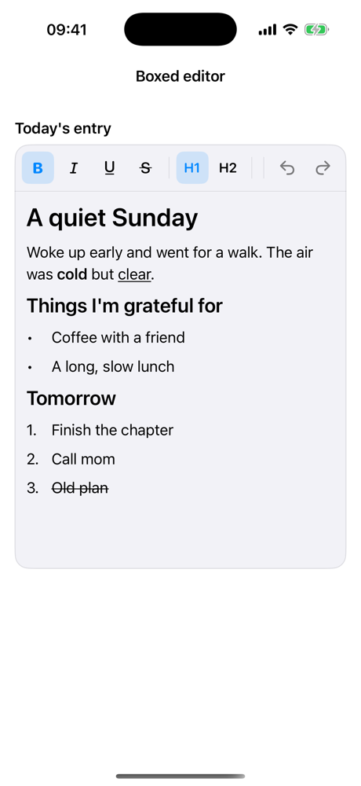
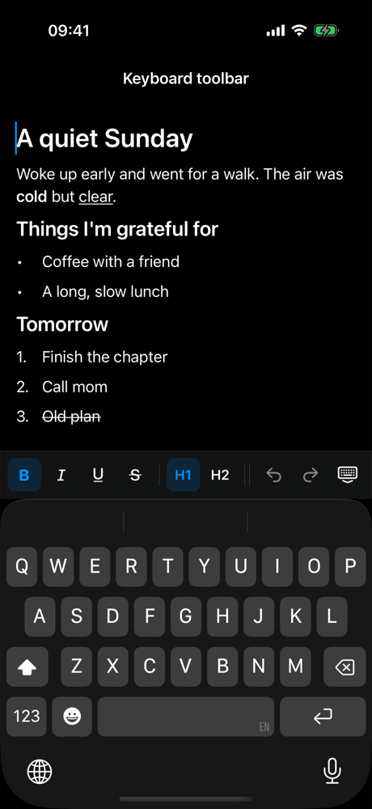
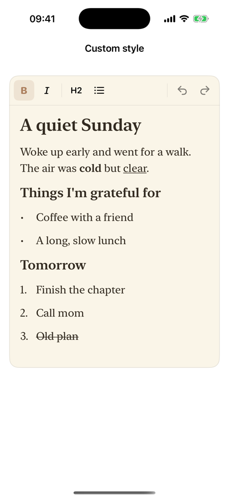
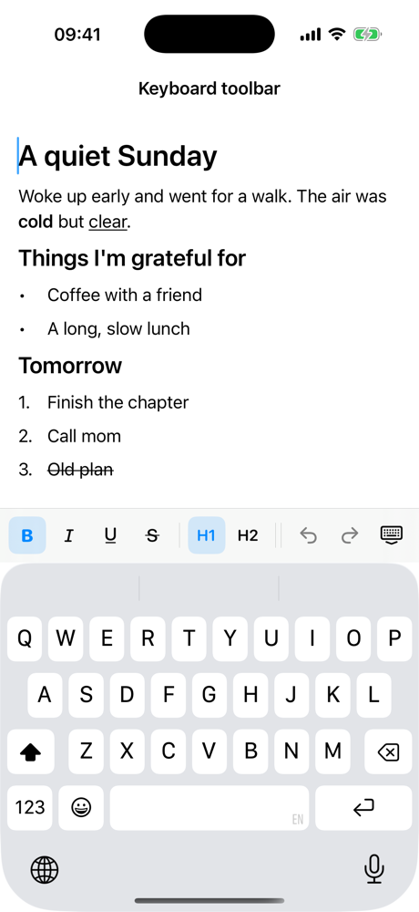
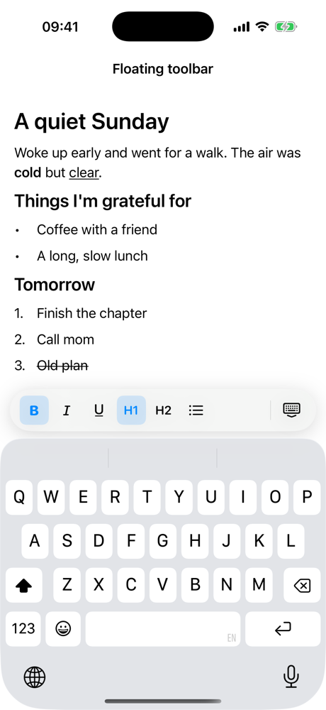
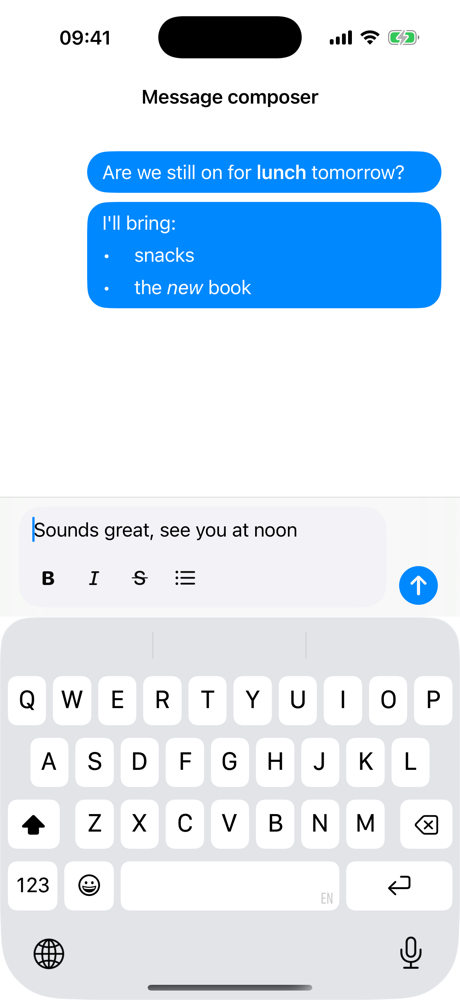

# MossTextEditor - Rich Text Editor for SwiftUI

[](https://github.com/ferenozcelik/moss-text-editor-swiftui/actions/workflows/tests.yml)


[](LICENSE)

A rich text editor for SwiftUI. Drop it into your app to let people write with bold, italic, headings and lists.

<p align="center">
  
  
  
</p>

## Features

- **Bold**, *italic*, underline and ~~strikethrough~~
- Title and heading paragraphs
- Bulleted and numbered lists. Typing `- ` or `1. ` at the start of a line starts a list
- A ready-made toolbar you can put above the keyboard or anywhere on screen
- Undo and redo
- Saving and loading
- Placeholder, dark mode, custom fonts and colors

Requires iOS 16 or later.

## Installation

In Xcode, choose **File → Add Package Dependencies…** and paste:

```
https://github.com/ferenozcelik/moss-text-editor-swiftui
```

## Quick start

```swift
import MossTextEditor
import SwiftUI

struct NoteView: View {
    @State private var text = NSAttributedString()
    @StateObject private var context = RichTextContext()

    var body: some View {
        VStack(spacing: 0) {
            RichTextToolbar(context: context)
            Divider()
            RichTextEditor(text: $text, context: context)
        }
    }
}
```

- `text` is the text together with its formatting. It updates as the user types.
- `context` connects the toolbar to the editor. Give the same one to both.

Prefer the toolbar above the keyboard? Leave out `RichTextToolbar` and the context, and pass `RichTextConfiguration(keyboardToolbarItems: RichTextToolbarItem.defaultItems)` to the editor.

## Choosing toolbar buttons

Pass the buttons you want, in order:

```swift
RichTextToolbar(context: context, items: [.bold, .italic, .divider, .bulletList, .undo, .redo])
```

The same list works for the keyboard toolbar through `keyboardToolbarItems`.

| Item | Button |
| --- | --- |
| `.bold`, `.italic`, `.underline`, `.strikethrough` | Text styles |
| `.title`, `.heading` | Paragraph styles. Tapping the active one turns the paragraph back into body text |
| `.bulletList`, `.numberedList` | Lists |
| `.undo`, `.redo` | Undo and redo |
| `.dismissKeyboard` | Hides the keyboard |
| `.divider` | A thin separator between groups |

`RichTextToolbarItem.defaultItems` has all of them.

When the buttons don't fit, the toolbar scrolls sideways. Undo, redo and dismiss keyboard stay pinned to the right edge so they are always reachable. To let them scroll with the rest, pass `pinsActions: false` to `RichTextToolbar`, or `keyboardToolbarPinsActions: false` to the configuration.

## Saving and loading

To save the text, turn it into `Data`. To load it, turn the `Data` back into text:

```swift
let data = try text.richTextData()                 // save this
text = try NSAttributedString(richTextData: data)  // load it back
```

You can store the `Data` anywhere: a file, SwiftData, Core Data, iCloud.

Need a file other apps can open, like TextEdit or Pages? Use RTF instead:

```swift
let data = try text.richTextData(format: .rtf)
text = try NSAttributedString(richTextData: data, format: .rtf)
```

## Options

Pass a `RichTextConfiguration` to the editor with only the options you want to change.

| Option | Default | Description |
| --- | --- | --- |
| **Text** | | |
| `bodyFont` | System 17 | Font of normal text. Bold and italic are derived from it |
| `titleFont` | System 28 | Font of title paragraphs. Titles are bold |
| `headingFont` | System 22 | Font of heading paragraphs. Headings are bold |
| `textColor` | `.label` | Color of the text |
| `tintColor` | none (uses the app's tint) | Color of the cursor, the selection and the active buttons of the keyboard toolbar |
| `lineSpacing` | `4` | Space between lines inside a paragraph |
| `paragraphSpacing` | `8` | Space after each paragraph |
| `listIndent` | `28` | How far list item text is indented from the bullet or number |
| **Layout** | | |
| `contentInsets` | 16 top/bottom, 12 left/right | Space between the edges of the editor and the text |
| `placeholder` | none | Text shown while the editor is empty |
| `placeholderColor` | `.placeholderText` | Color of the placeholder |
| `isScrollEnabled` | `true` | When `false`, the editor doesn't scroll and grows as tall as its text. Use it inside your own `ScrollView` or for chat-style inputs |
| `maxHeight` | none | With `isScrollEnabled: false`, the editor grows with its text up to this height, then scrolls |
| `showsScrollIndicator` | `true` | Shows the scroll bar while scrolling |
| **Behavior** | | |
| `isEditable` | `true` | When `false`, the text can be read and selected but not changed |
| `keyboardDismissMode` | `.interactive` | How the keyboard hides when scrolling the text |
| `maxLength` | none | The most characters the user can type or paste. Pasted text is cut to fit |
| `autocorrects` | `false` | Turns on the system's autocorrection |
| `autoformatsLists` | `true` | Typing `- `, `* ` or `1. ` at the start of a line starts a list |
| `pastesPlainText` | `true` | Pasted text takes the style at the cursor instead of keeping its original formatting |
| **Keyboard toolbar** | | |
| `keyboardToolbarItems` | `[]` (no toolbar) | Buttons shown above the keyboard. See [Choosing toolbar buttons](#choosing-toolbar-buttons) |
| `keyboardToolbarPinsActions` | `true` | Keeps undo, redo and dismiss keyboard pinned to the right edge of the keyboard toolbar |

## Recipes

Each recipe is a complete screen in the example app. Open `MossTextEditor.xcworkspace`, run **MossTextEditorExample**, and copy the file you like.

<table>
<tr>
<td width="240"></td>
<td>

### Boxed editor

The toolbar sits on top of the text inside a rounded box, like a form field.

```swift
VStack(spacing: 0) {
    RichTextToolbar(context: context)
    Divider()
    RichTextEditor(text: $text, context: context)
        .frame(height: 260)
}
.background(Color(.secondarySystemBackground),
            in: RoundedRectangle(cornerRadius: 16))
```

[`BoxedEditor.swift`](Example/MossTextEditorExample/Shared/BoxedEditor.swift)

</td>
</tr>
<tr>
<td width="240"></td>
<td>

### Keyboard toolbar

A full-screen editor with the toolbar right above the keyboard. No context needed.

```swift
RichTextEditor(
    text: $text,
    configuration: RichTextConfiguration(
        keyboardToolbarItems: RichTextToolbarItem.defaultItems
    )
)
```

[`KeyboardToolbarExample.swift`](Example/MossTextEditorExample/Examples/KeyboardToolbarExample.swift)

</td>
</tr>
<tr>
<td width="240"></td>
<td>

### Floating toolbar

A capsule that floats above the keyboard and only shows up while typing.

```swift
RichTextEditor(text: $text, context: context)
    .overlay(alignment: .bottom) {
        if context.isEditing {
            RichTextToolbar(context: context,
                            items: [.bold, .italic, .title, .bulletList])
                .background(.regularMaterial, in: Capsule())
                .shadow(radius: 12, y: 4)
                .padding()
        }
    }
```

[`FloatingToolbarExample.swift`](Example/MossTextEditorExample/Examples/FloatingToolbarExample.swift)

</td>
</tr>
<tr>
<td width="240"></td>
<td>

### Message composer

A chat input that grows with its text. Sent messages are shown with the same editor, read-only.

```swift
VStack(spacing: 0) {
    RichTextEditor(
        text: $draft,
        context: context,
        configuration: RichTextConfiguration(
            placeholder: "Message",
            isScrollEnabled: false
        )
    )
    if context.isEditing {
        RichTextToolbar(context: context,
                        items: [.bold, .italic, .bulletList])
    }
}
```

[`MessageComposerExample.swift`](Example/MossTextEditorExample/Examples/MessageComposerExample.swift)

</td>
</tr>
<tr>
<td width="240"></td>
<td>

### Your own look

Serif fonts, warm colors and roomy spacing turn the same editor into a paper notebook.

```swift
RichTextConfiguration(
    bodyFont: serif(19),
    titleFont: serif(30),
    headingFont: serif(23),
    tintColor: .systemBrown,
    lineSpacing: 6,
    paragraphSpacing: 12
)
```

[`CustomStyleExample.swift`](Example/MossTextEditorExample/Examples/CustomStyleExample.swift)

</td>
</tr>
</table>

## License

MIT. See [LICENSE](LICENSE).
